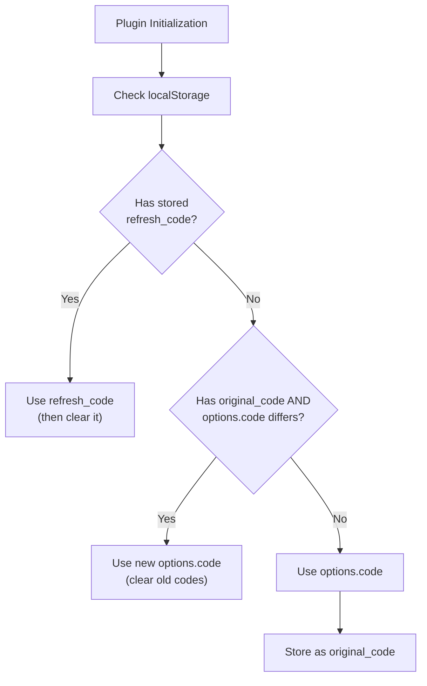
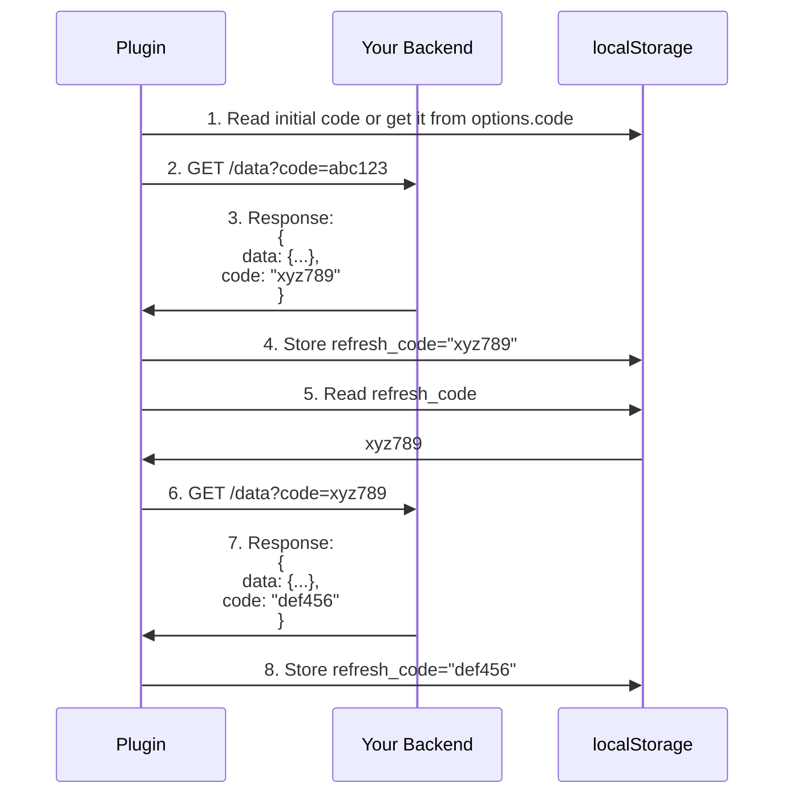
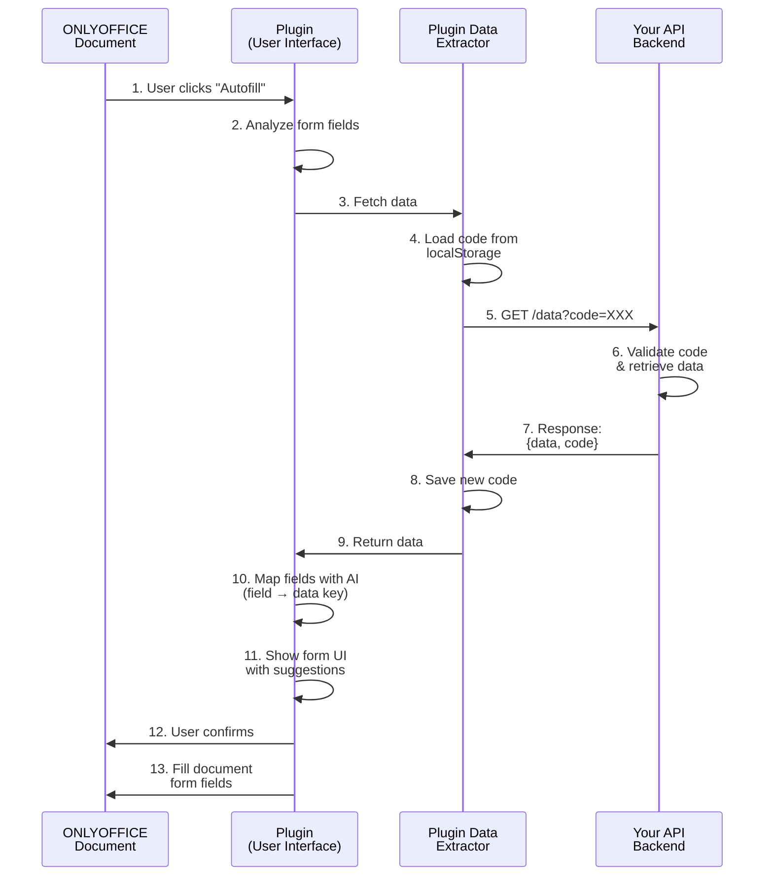

# AI Auto Fill Plugin - Third-Party Integration Guide

## Description

The AI Auto Fill plugin for ONLYOFFICE enables automated form filling using AI-powered field mapping. This guide explains how to integrate your backend service as a data provider for the plugin.

## Table of Contents

-  [Quick Start](#quick-start)

-  [Configuration](#configuration)

-  [Code Rotation Security](#code-rotation-security)

-  [Callback Endpoint](#callback-endpoint)

-  [Integration Flow](#integration-flow)

-  [Error Handling](#error-handling)

## Quick Start

To integrate with the AI Auto Fill plugin, you need to:

1.  **Configure the plugin** with your callback URL (required) and initial code (required) for security purposes.

2.  **Implement a callback endpoint** that returns composed data from a third-party API which will be used for form matching and filling.

3.  **Support code rotation** to securely call your backend's data endpoint and for secure subsequent requests.

## Configuration

### Plugin Initialization

Configure the plugin through ONLYOFFICE Document Server's plugin configuration:

```javascript

// When initializing the ONLYOFFICE Document Server configuration
const config = {
	// some configuration before
	editorConfig: {
		// some configuration before
		plugins: {
			autostart: ['asc.{6A95DA5C-857E-4C26-B00B-34876F1EEAD8}'], // to automatically open the plugin
			options: {
				'asc.{6A95DA5C-857E-4C26-B00B-34876F1EEAD8}': {
					code: 'some_initial_generated_code', // code for security purposes
 					callback: 'http(s)://your_backend/your_data_endpoint', // your data extraction endpoint
				}
			},
			pluginsData: [
				'http(s)://you_backend/path_to_plugin/config.json' // location to plugin's config.json
			],
			url: 'http(s)://your_backend/path_to_plugin' // location to plugin
		},
		// some configuration after
	}
	// some configuration after
};

// Proceed with your usual initialization
```  

## Code Rotation Security

The plugin implements a **code rotation** mechanism to enhance security. Each API response must include a new code that will be used for the next request.

### How Code Rotation Works

```
Request 1: ?code=initial Response 1: { data: {...}, code: "abc123" }

Request 2: ?code=abc123 Response 2: { data: {...}, code: "def456" }

Request 3: ?code=def456 Response 3: { data: {...}, code: "ghi789" }
```

### Code Storage Logic

The plugin stores codes in localStorage with the following logic:

1.  **Initial Code**: Provided via `options.code` in plugin config

2.  **Refresh Code**: Received from API response, used for next request

3.  **Original Code**: Stored to detect config changes



### Code Rotation Sequence Diagram



## Callback Endpoint

### Request Format

The plugin makes GET requests to your callback URL:

```
GET {callback}?code={current_code}
```

**Example:**

```
GET https://api.example.com/data?code=abc123xyz
```

### Response Format

Your endpoint must return a JSON response with two required fields:

```json
{
	"data":  {
		// Your form data object
	},
	"code": "next-access-code"
}
```

#### Response Validation

The plugin validates responses with the following checks:
1. Response must be a valid object

2. Must have `data` property

3. Must have `code` property (string type)

### Example Response Structures

#### Simple Flat Data

```json
{
	"data": {
		"firstName": "John",
		"lastName": "Doe",
		"email": "john.doe@example.com",
		"phone": "+1-234-567-8900",
		"address": "123 Main St"
	},
	"code": "xyz789abc"
}
```

#### Nested Data

```json
{
	"data": {
		"user": {
			"name": {
				"first": "John",
				"last": "Doe"
			},
			"contact": {
				"email": "john.doe@example.com",
				"phone": "+1-234-567-8900"
			}
		},
		"company": {
			"name": "...",
			"address": "..."
		}
	},
	"code":  "abc123"
}
```

The plugin will extract nested keys as dot-notation paths:

-  `user.name.first` → "John"

-  `user.name.last` → "Doe"

-  `user.contact.email` → "john.doe@example.com"

#### Array Data

```json
{
	"data":  {
		"employees":  [
			{
				"name":  "John Doe",
				"position":  "Manager"
			},
			{
				"name":  "Jane Doe",
				"position":  "Developer"
			}
		]
	},
	"code":  "abc123"
}
```

For arrays, the plugin extracts keys from the first element:

-  `employees.name` → ["John Doe", "Jane Smith"]

-  `employees.position` → ["Manager", "Developer"]

## Integration Flow

### Complete Integration Sequence



### Key Steps Explanation

1.  **User Interaction**: User clicks "Autofill" button in the plugin UI

2.  **Form Detection**: Plugin uses internal API to get all form fields

3.  **Data Request**: Plugin triggers data fetch from your backend

4.  **Code Loading**: Plugin loads the current code (initial or refresh code)

5.  **HTTP Request**: GET request to your callback URL with code parameter

6.  **Backend Processing**: Your backend validates the code and retrieves user data

7.  **Response**: Your backend returns data object and new rotation code

8.  **Code Storage**: Plugin saves the new code for next request

9.  **Data Processing**: Plugin receives and processes the data

10.  **AI Mapping**: Plugin uses AI to map form fields to data keys

11.  **User Review**: Plugin shows UI for user to review mappings

12.  **User Confirmation**: After clicking apply, the user sees a confirmation dialog

13.  **Form Filling**: Upon confirmation, plugin fills the document form fields

## Error Handling  

### Error Response Handling

```javascript
// Example error scenarios the plugin handles:

// 1. Invalid response structure

{
	// Missing "data" or "code" fields
	// Plugin will throw: "Invalid API response: missing data property"
}

// 2. Network timeout (5 second limit)
// Plugin will throw: "Failed to fetch data: timeout"

// 3. HTTP errors
// Plugin will throw: "HTTP error! status: 404"
```

## Best Practices

### Security

1.  **Code Generation**

- Generate cryptographically secure random codes

2.  **Code Validation**

- Validate code on every request

- Rate limit requests per code

3.  **User Association**

- Map codes to specific contexts for users

- Never expose user IDs in codes

- Validate user permissions

### Performance

1.  **Response Size**

- Return only necessary data fields

- Implement pagination for large datasets

2.  **Timeout Handling**
- Respond within 5 seconds (plugin timeout)

- Use async processing for complex operations

### Data Structure

1.  **Field Naming**

- Use descriptive field names

- Follow consistent naming conventions (camelCase or snake_case)

- Avoid special characters in field names

2.  **Nested Data**

- Organize related fields in nested objects

- Keep nesting depth reasonable (max 3-4 levels)

- Use arrays for repeating data structures  

## Support

For plugin-related issues or questions, please refer to:

-  **ONLYOFFICE Plugin Documentation**: https://api.onlyoffice.com/docs/plugin-and-macros/get-started/

-  **ONLYOFFICE Community Forum**: https://forum.onlyoffice.com/